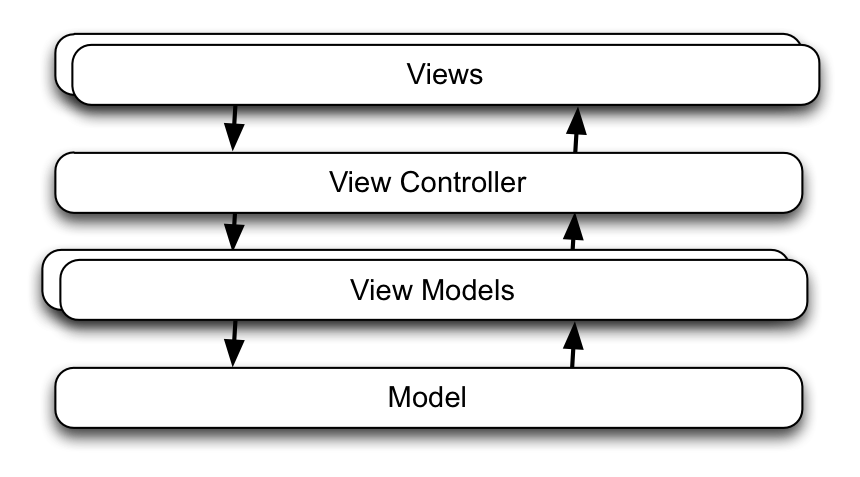
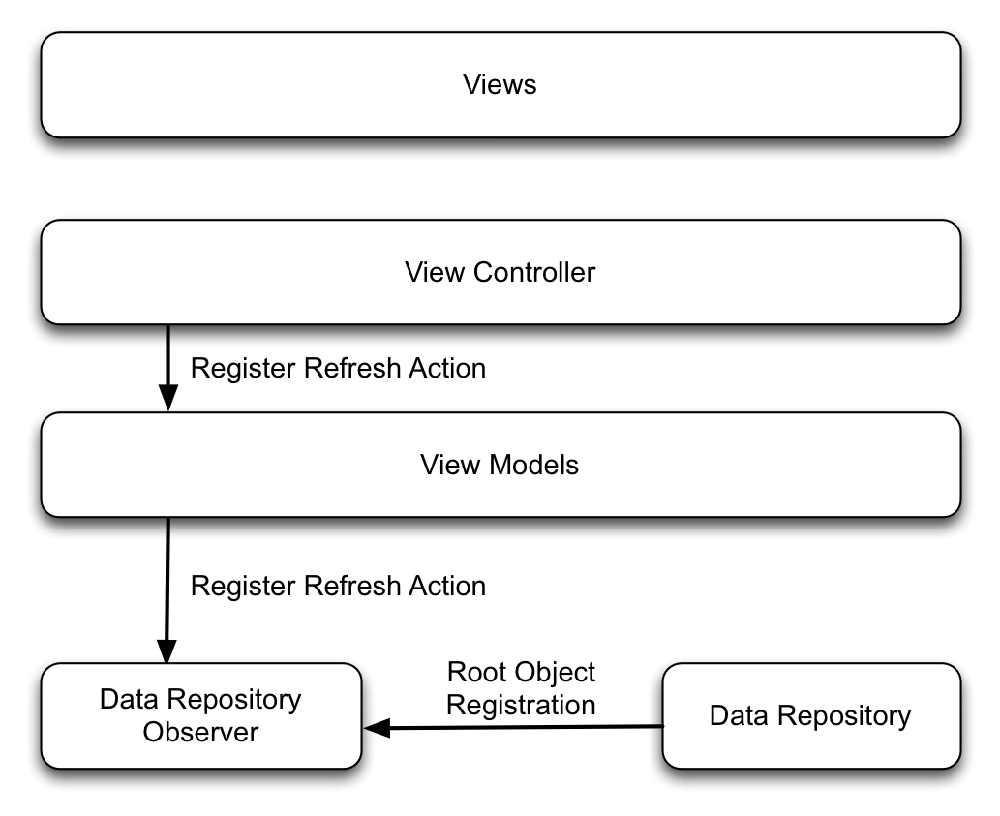
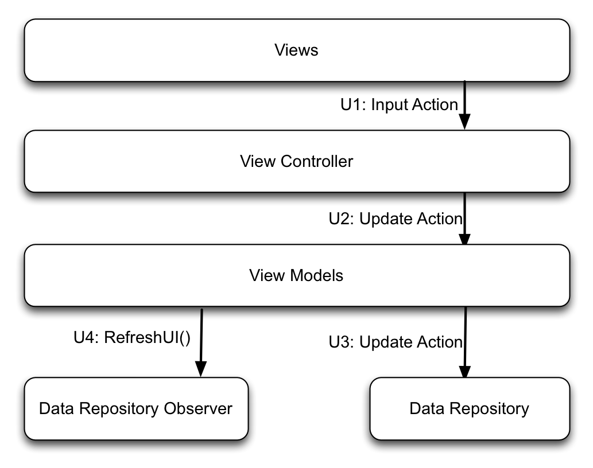

# Quantwm

Quantwm is an application level Swift framework allowing to build complex applications with a data centric, event driven, reactive AND synchronous architecture, enforcing an unidirectional data flow. 

This is a first version of the framework, not recommended yet to be used in a live application. I will now start migrating my own application to this framework, and update it when needed.

I encourage you to also try it on test version, and provide me feedback.

The current version is mainly targetted toward swift, with limited support of Objective-C.

****************

# Introduction

Software Engineering is a mix of art of science. The purpose of this book is to push this border a little more from art to science, by defining a clear architecture pattern for UI, and by extension, to the management of the main thread of the application.

This book assumes that the reader has a good knowledge of programming, and has already made one or two simple applications preferably in Swift, in order to grasp the basic concepts and be able to follow the code samples. The goal is here to explain how to build your next complex application using a strong, well-defined architecture: event-driven, data-centric, with layer isolation.

A simple application usually just works, whatever the chosen architecture, because the interaction between components is naturally low, the mapping between the data model and the user interface is trivial, and the number of user scenarios is low.

When dealing with complex applications, where a large number of components are interacting and sharing data, with background network or file system operations, simple architecture schemes which were satisfactory for basic applications are not valid, because they cannot cope with this exponential complexity. And the mere theoretical knowledge of what should be done is not sufficient: programmer need a strong, well defined rules for each data, interaction and components.

Experienced programmers know how to cope with this complexity, by reducing to the extreme limit the interactions between components, by assigning a specific role to each class, and by defining a unidirectional data flow. 

My goal here is to present a set of software architecture rules and concepts based on the good practices and ideas which are emerging from many different places, and to combine them into a comprehensive architecture allowing to build solid applications from the beginning.

I have presented in April 2016 at Cocoaheads Paris the main lines of the architecture of my OSX in-progress application, which is a complex hybrid between a spreadsheet, a database and a browser. I received a great support from present people, which were very interested into this presentation, because it was an application level architecture trying to make things simpler, without requiring a framework. Nicolas Bouilleaud challenged me to make it more dynamic, and I started to develop the Quantwm framework, which I will present in this book. 

I named the Quantum MVVM Framework "Quantwm" (pronounced Quantum) in order to avoid any trademark or copyright issues, and simplify future web searches on internet.

I decided to pause my application development and to write this book and to share this work with the community in order to speed-up the adoption of these good practices, and accelerate the development of this framework.

# MVVM: The nice part and the missing part

The MVVM architecture pattern is a User Interface pattern. Its goal is to model how user interface views are managed and connected to the Data Model.

In this chapter, we will present this pattern and details its strengths, and then list the issues usually faced when applied to a complex application.

The MVVM (Model - View - View Model) architecture is an extension of the MVC (Model-View-Controller) architecture, which splits the software responsibility between 4 layers / components:

The **Views** are graphical objects which are displayed on the User Interface, and allow interaction with the User.

The **View Controller** owns the **Views**, owns the **View Models**, and connect them together. In the M-V-VM, the V stands for both the View Controller and its Views. 

The **Model** or **Data Repository** manages the persistent data of the application.

The role of each **View Model** is to convert a set of raw data from the **Model** into a processed, ready to be used by the **Views** content data.

## The nice part

Let's now details strengths of this architecture.

### Layer Isolation

MVVM enforces isolation between 4 layers:

1. Views Layer
2. View Controller Layer
3. View Model Layer
4. Data Repository Layer

This means for example that View Controller does not communicate directly with the Data Repository, but only through the View Model which in turn communicates with the Data Repository. We will see later exactly which communications are allowed, and in which direction.

This is a good constraint, because it really helps to enforce a Single Responsibility Principle and to reuse the code. At the end of this book, we will have added additional responsibilities to View Models which will make this constraint even more attractive.

### Single Responsibility Principle

Each layer has a defined role:

* Views:
* Display data content
* Display presentation
* Notify View Controller of a user input
* View Controller:
* Manage its child view controller hierarchy
* Create and Manage its View hierarchy
* Create and owns the View Models needed to populate its views
* Register to the Data Repository in order to be notified on data update.
* Connects the Views with their associated View Models
* On View input action, call the associated View Model input action
* When Data Repository is updated, update its own Views from the View Model read content action.
* View Model:
* On input action, perform Data Repository updates.
* On read content action, retrieve Data Repository raw values and process them into view content value.
* Data Repository:
* Store and Archive the persistent raw data.

In this pattern, the View Controller is the master of the User Interface. He is coordinating the input and output actions, and has a central role. Views and View Models are slaves, created and dismissed by the View Controller, and serving under its orders.

The Model is a central resource which is storing the data, and notifying its changes to the registered View Controller. 

### Modifiability

Change Happens.

By using MVVM, the View / View Model pairing allows to reuse your View Models in several position in your application.

## MVVM: What is missing?

Building an application using the architecture pattern above is a good start, and for simple applications, will be enough. But for complex applications, this is an other story.

A complex application has the following additional constraints versus a simple application:

### Complex View Hierarchy

A complex View hierarchy translates either into:

* a complex view controller hierarchy and the problem of sharing and synchronise contextual data between them or
* a massive and complex view controller.

In both cases, complex communication issues occurs between these view controllers, without forgetting the additional need to archive/restore this hierarchy when needed to provide a nice user experience.

### UI Refresh depends of a set of data

If a displayed component is the result of the processing of a set of raw values, then it shall not be processed each time one of these element is changing, but only once all the values are changed.

The processing of the Model data, or the refreshing of it, can take a significant amount of processing power, and shall be limited to the case where data has effectively changed.

In the worst case, recomputing the whole UI each time one on the original value has changed may have significant processing / UI impact.

### Exponential increase of scenario and transitions

As the number of transitions and the complexity increase, the number of scenarios explode exponentially. To manage this complexity, it is utterly vital to reduce this complexity by limiting the communications between components, and to ultimately reduce it to the view hierarchy configuration and the update of views from the data model. This strategy has a good code coverage and tends to resolve into: if it can display correctly all the possible cases, then it works.

## Practical issues

Let's list the practical issues which are raised with MVVM when dealing with a complex application (or even with simple ones), and appreciate how asking the right question is more than half-way to solve it:

### Shared Context Data:

A context data is a variable which is not stored persistently in a file, but describe a display or contextual state of the application, like which tab is selected or which view has the focus. A local (= non-shared) context variable shall be owned by its view controller, but which component should own a shared context data? Storing them in the common ancestor view controller creates strong inter-view controller dependencies which prevent easy refactoring and change of view controller hierarchy, which is bad for modifiability, and is violating the simple responsibility principle because these variables are not related to the role of this ancestor.

### Coordinated Data Update: 

When the content of a view depends on the processing of a set of raw data, and if several of these data are modified during the same event loop, this view content is updated several times. The data model is unaware of the association and usage made of these data by the View Model, and alerts the View Controller at each update. If the updates are performed inside the same event loop, this is just wasted processing time, but the situation is even worse if the notifications are not performed during the event loop (case of Reactive) because its triggers successive refresh and a flickering of the User Interface and the need of an additional coordination of these updates.

### Registration on non-yet existing data:

If a View Controller depends on a data which may be present or not, KVO is not helping because you cannot register on an object which does not yet exist.

### Communication with View Controllers: 

The problem when communicating with a view controller, it is that they are not permanent. By design, View Controllers are created and dismissed according to the UI layout needs. This is not an issue is there is only one active View Controller, but this creates a communication failure possibility when communicating between child of a same ancestor, and even a parent communicating with his child on an update will have to wait for the dismissed Child View Controller to disappear and the created Child View Controller to reach the ViewDidLoad or ViewWillAppear state before communication is possible. A clear set of rules on which communication is allowed between View Controller is thus needed.

### Data Repository Abstraction: 

View Controller shall register to the data update, but it is the View Models who knows which data they are reading from the Model. The View Controller should not be aware of these data model details, but only of the content data. A good registration interface should abstract the model.

### Update Synchronisation: 

When a data is updated, notification are fired to all the registered entities. But sometime, you need to perform update sequentially in a defined order. 
What is the component in charge of ordering the update?

### Refresh Loop: 

The more complex the data flow, the more likely the creation of a refresh loop where data are updated circularly in an infinite loop. A well defined, uni-directional data flow is the best way to avoid them.

## Conclusion

The main reason why the previously described MVVM pattern needs improvement is that several View Controllers shall coordinates their Views and share contextual variable. 

The contextual variable are usually stored in the common view controller ancestor, who will have to manage and coordinate the changes between its child view controllers. This coordinated management is itself redundant with the view controller restoration management.

MVVM is a User Interface level architecture pattern, and as such, does not address the complexity an Application Level architecture. Quantum MVVM propose an architecture level pattern which integrates MVVM for its User Interface part.

# Solution Overview

Let's introduce in this chapter a high level description of Quantum MVVM, and detail in the following chapters each concept.

## Overview

First, let's define the **Data Repository** as an abstraction which unifies under a common data monitoring API:

- the **Data Model** persistent storage, which owns, archives and restore the persistent application or document data
- the **Context Manager** storage, which owns, archive and restore the contextual data shared between the View Controllers. Contextual data local to a View Controller should be archived and restored by this View Controller.

Each monitored data is identified by a **Keypath** composed of a root object and a chain of properties, similar to Key Value Coding. This keypath is defined statically, and does not requires the existence of the root object.

In a simple application, a single View Controller is the central actor coordinating all the interactions between User and Data Repository.

In a complex application, several View Controllers are interacting simultaneously, and create the need of a central actor, the **Repository Observer** in charge of coordinating the interactions between the different View Controllers and the Data Repository.

Quantum MVVM structures the interactions between the View Controllers (and their View Model) and the Data Repository in 2 categories:

- Update actions, which are updating the Data Repository and shall not refresh the User Interface.
- Loading Actions, which are reading from the Data Repository and are refreshing the Views, but shall not update the triggering monitored data.

In order be notified, each View Controller shall register with the **Repository Observer** its Refresh Action based on a triggering set of keypath.

At the end of each event loop, after the last Update action, the Repository Observer will:

- Poll the **Data Repository** to detect updates performed
- Depending on these updates, trigger the View Controllers Refresh Action which will refresh the User Interface.

The old observing contract between the View Controller and the Model was _"This data has changed. Me, Model, I do not care if you need other data to display your view. By the way, you may receive or not other notifications soon about other data that your view also need before your view is even displayed. I let you decide how you manage this. You may decide to always reread and refresh each time a single data change. Or have a global notification to redisplay everything each time a single data change. I wish you good luck."_

With Quantum MVVM, the new contract between the View Controller and the Repository Observer will become: _"Me, Repository Observer, I am informing you, View Controller, following the changes just performed on the Data Repository in this event cycle, that all the data which are needed by your views have reached a coherent state. I request you to read all the data needed to refresh your views before this call returns. This will be your unique notification."_

The communication between View Controllers shall be limited to creation/dismiss and initialization of child view controllers. All data exchange between View Controllers shall be performed via the Data and Context repository.

Let's illustrate these different phases.

## Registration Phase

On View Controller creation, the View Controller shall register its Refresh Actions via its View Model, following target-action pattern.

On Root Object creation, the root object shall register itself.

## Update Phase

On each input, the View Controller shall update the Data Repository via its View Model.

- U1: Input Action initiated by user interface
- U2-U3: Update of Data Repository, repeated as many times as needed.
- U4: After the last update of the event loop, call refreshUI().

## Refresh Phase

On refreshUI() call, Data Repository Observer will perform, for each registered Refresh Action:

- R1: Polling of the Data Repository to check if one of the registered keypath has been updated.
- R2: If yes, then call synchronously the Refresh Action of the View Controller, else perform R1 on the next registered refresh action.
- R3-R4-R5: View Controller loads view content from the Data Repository via View Model and refresh its Views.
- R6: The synchronous Refresh Action call returns.

An important additional concept is that in phase R3-R4, View Model may write data if and only if this data is not modifying the already evaluated keypath in the previous R1 steps of the current event loop, as detailed in  "Concept: Dependency Management"

## Comparison with Reactive

And for experienced programmers, a small advance reflexion if you are just thinking that the description above is very close of **Reactive** paradigm. And it's true. Both **Quantum** and **Reactive** are capturing values of a set of variables, defining a contract on the state of these variables, and perform an action on this set. The fundamental difference resides in both the way the values are captured and the time at which this closure is scheduled.

**Reactive** captures the values by performing a copy of the value into a signal, and schedules the execution of a closure asynchronously on the requested thread.

**Quantum** captures the value by enforcing that the value will not change until the end of the event loop, and call the registered target/action inside the event loop before the event call returns.

Both methods are very powerful, and complement themselves. **Reactive** is best suited for asynchronous processing: networking, user input until reaching a state which can be shared by the view controller, interaction between threads. **Quantum** is best suited for synchronous management of complex or massive interfaces. We could describe **Quantum** as an efficient, synchronous **Reactive** where you can see the full stack which is triggering your action and only be called at most once inside your event loop.

And as personal preference, I find more natural to pull data from repository when the view controller has a confirmed need of it, rather than systematically pushing it to the view controller.

## Next steps

The first chapter presented MVVM, and its strengths and weakness.
This chapter presented an overview of Quantum MVVM.

The next chapters will details the concepts required to understand Quantum, and also try to justify the enigmatic origin of the name "Quantum":

- The Event Loop, Freezing Point and Cold Phase
- Keypath and Observable
- Transactions
- Dependency Management
- View Controller hierarchy configuration

The Part 2 will provide detailed Quantum user guide and API details for each component:

- Data Repository
- View Controller
- View Model

The Part 3 will consider more advanced topics (TO DO):

- Quantum Migration Guide
- Interaction with background threads
- Evolution toward standard Quantum User Interface components
- Unit Testing

**********************

The rest of the manual is in my nice book, containing a detailled description of how it works and the associated concepts.
This is all work in progress, but its 70% complete.

[Quantum MVVM](https://leanpub.com/quantummvvm)

